# Lab 1240:

## Liberty Getting Started

WebSphere Liberty (**Liberty**) is a lightweight open framework for building fast and efficient cloud-native Java microservices. Build cloud-native apps and microservices while running only what you need. It is the most flexible server runtime available to Java developers in this solar system.

Liberty is built on the open source Open Liberty codebase. Open Liberty is designed with both developers and application business owners in mind.

* It delivers the latest Java APIs and integrates with the most popular Developer and Build tools.
* It has built-in innovation like zero-migration to reduce application runtime costs and delivery effort.
* Liberty is downstream of Open Liberty so anything that works on Open Liberty works on Liberty.
* Same Monthly Continuous Delivery Release Cycle as Liberty
* You do not need to switch to Liberty for commercial support

**Liberty Tools** is a set of intuitive developer tools for the Eclipse IDE, Visual Studio Code, and IntelliJ IDEA development environments. These tools adopt a Maven/Gradle-centric approach and enable fast, iterative cloud-native Java application development through Liberty dev mode.
Liberty Tools also provides helpful, time-saving features such as code completion, hover descriptions, and configuration diagnostics for Jakarta EE APIs, MicroProfile APIs, and Liberty configuration. For more information, check out the Liberty Tools overview.

In the lab, there are different roles involved with performing different tasks and using different tools. You perform all the different roles during the lab. 

* You start as an application developer and use Liberty starter and the code assistant to develop a simple web application. But don't worry, you do not have to be a developer to do this.
* As Liberty configuration operator, you use the configuration assistant and concepts like includes and variables to create a portable configuration. 
* As Liberty administrator, you install Liberty from a kernel image, add missing features, configure logging, security, and so on, you use the Liberty REST APIs to review the configuration and use Liberty Admin Center for monitoring.

**These are the objectives in the lab:**

* As an application developer:
    * Tasks: 
        * Develops the application.
        * Creates a basic Liberty configuration for the application
    * Tools:
        * Apache Maven 
            * to build the project 
            * to download the Open Liberty server runtime from the maven repository
        * Liberty Maven Plugin for inner-loop development via Liberty Dev Mode
            * to build the application war and deploy it to Liberty
        * Visual Studio Code 
            * as IDE to build the application code
        * Liberty Tools plugin for Visual Studio Code
            * provides a Liberty dashboard with Dev Mode integration in the IDE
            * provides Jakarta EE and MicroProfile code assistance
            * provides Liberty configuration assistance
        * Liberty Starter Project 
            * to generate a maven project for Liberty 
        * Open Liberty / WebSphere Liberty
            * as runtime for the Java application that is developed
            * to create a server package

* As a Liberty configuration operator:
    * Tasks: 
        * Extract Liberty package from command line and implement Liberty dynamic updates
        * Develop portable Liberty configuration snippets by using includes, variables and much more.
    * Tools:
        * Visual Studio Code with Liberty Tools plugin as editor with configuration assistance

* As a Liberty administrator:
    * Tasks: 
        * Installs Liberty
        * Configures Liberty for the target application using Liberty configuration snippets
        * Applies security to harden the Liberty configuration
        * Configure logging using configDropins
        * Review the configuration using Liberty REST APIs
        * Monitor Liberty using the Admin Center
    * Tools:
        * Liberty server command to create a Liberty instance and start, stop or dump it
        * Liberty installUtility to install missing features
        * Liberty securityUtility to create a keystore or encode a password
        * Liberty REST APIs and Admin Center

### Access the lab environment

1. Access the lab environment from your web browser.

    The lab environment page is displayed below. The lab environment contains one Linux VMs, with the Graphical User Interface (GUI) for you to access and work in this lab.
 
    

2.  Click **Red Hat** icon to access it.

    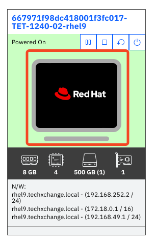
    
3.  Click **techzone** user to log in.

    
    
4. Enter the password as: **IBMDem0s!** and press **Enter**.

    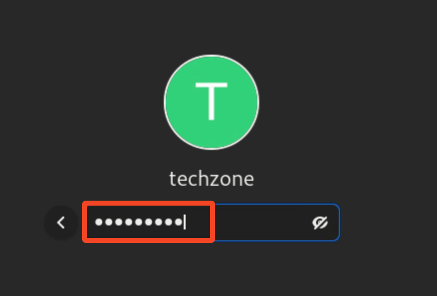
    
    **Note:** That is a numeric zero in **IBMDem0s!**

    The lab VM GUI is displayed.

    

### Tips for working in the lab environment:

1.  You can use the VM Desktop tools to fit to a window or resize the
    window.

    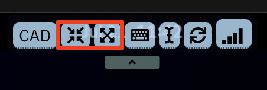

2.  To copy text from the lab guide into the lab
    environment, you have to use the VM Desktop Send Text tool.

    
 
    a. Copy the text from the lab guide that you want to paste into the lab environment.
 
    b. Open a terminal window, or a text editor or a web browser in the VM Desktop where you want to copy the text to.
 
    c. Click the **Send Text** icon in the VM Desktop tool bar, paste the text into its window, then again click **Send Text** to send the text to the VM Desktop environment and close its window.
 
    
 
    The text is now copied to the terminal window, or the text editor or the web browser you opened in the previous step.
 
    
        

### Execute Lab Tasks

### 1 Create the required working directories

1. Double-click the terminal icon to open a terminal window.

     

2. Create a **Student** directory and some sub-directories that are used in the lab with the following commands:

        mkdir ~/Student
        mkdir ~/Student/dev
        mkdir ~/Student/ops
        mkdir ~/Student/assets

### 2 Develop a Liberty web application

The objective of this section is to develop a simple web application for Liberty. You use a **Liberty starter application** to now start from scratch and use Visual Studio Code and Liberty Tools to build the application.

### 2.1 Create a starter app project.

In this scenario, you want to create a Jakarta EE 10 Web application with the name **simpleweb** and use **maven** to build it. The fastest way to get started is to use an Open Liberty starter application, which generates a project with the **maven** configuration as well as a basic Liberty setup.

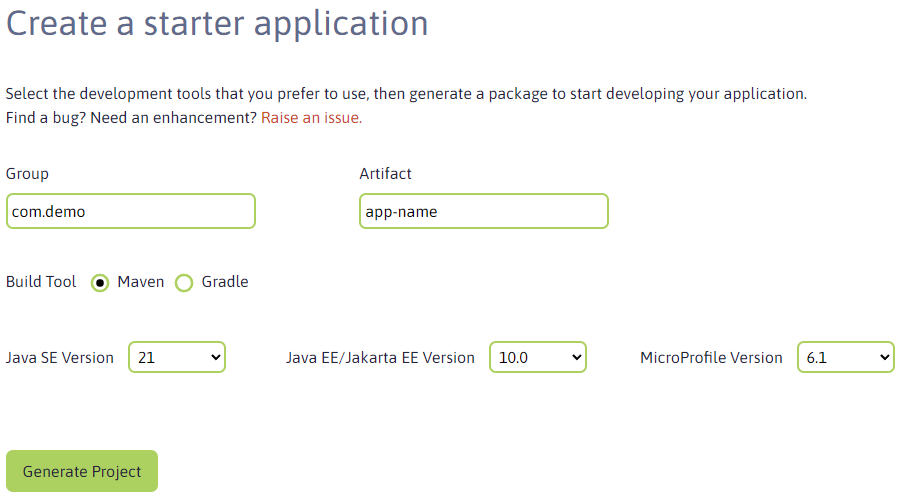

The **Open Liberty starter** gives you a simple, quick way to get the necessary files to start building an application on Open Liberty. There is no need to search how to find out what to add to your maven or gradle build files. A simple **RestApplication.java** file is generated for you to start creating a REST based application. A **server.xml** configuration file is provided with the necessary features for the MicroProfile and Jakarta EE versions that you previously selected. 

1. Click the **Activties** button.

    

2. Open a browser window by double-clicking on **Activities** and then select the **Firefox** browser icon.

    

    If you get a pop-up that Authentication is required, enter **IBMDem0s!**. 

    

3. Type the URL as: **https://openliberty.io/start/** and press **Enter**.   
    

4. Change the artifact name to **simpleweb**, change the Java level to **17** and leave the rest as is, then click **Generate project** 

    

    The project zip file is saved under the **Downloads** directory.

    

5. You see a pop-up like the one below. Click **Got it!** to close the window.

    

6. Extract the file.

    a. Click **Activities** and switch to the terminal window. 
    
    b. Move the starter project to the developer directory and extract it with commands:

        mv ~/Downloads/simpleweb.zip ~/Student/dev
        unzip ~/Student/dev/simpleweb.zip -d ~/Student/dev/simpleweb

    

    The project is created under the **~/Student/dev/simpleweb** directory.
    
    c. List the content via following command:

        ls -lrt ~/Student/dev/simpleweb

    

### 2.2 Inspect the starter project in Open Visual Studio Code

Now you use Visual Studio Code to see what is generated as part of the starter project.

1. From the terminal window, start Visual Studio Code.

        cd ~/Student/dev/simpleweb/
        code .

    

    Visual Studio Code UI is opened.

2. Click **Yes, I trust the authors** to continue.

    

    If you see during the lab one of the following pop-ups or any other pop-up asking to install something, close the pop-up without installation by clicking the **X**.
    
    

3. Investigate into the generated project:

    In Visual Studio Code, look at the **Explorer** section to see the content of the project.
    You can find a **src** and a **target** folder, a **Dockerfile** and a maven build file (**pom.xml**).

    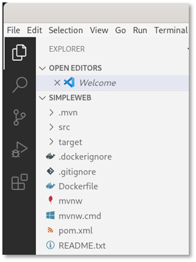

4. Look at the generated Maven configuration 

    a. Click **pom.xml** to see the maven pom. In the build section, you can find the configuration of the **liberty-maven-plugin**.

    

    <table>
    <tbody>
    <tr class="odd">
    <td width=80></td>
    <td>
    
Don’t worry if the version of the plugin has changed to 3.10.2 or later.
    
</td>
    </tr>
    </tbody>
    </table>

    b. Finally close the **pom.xml** file.

5. Review the generated Liberty configuration.

    a.  Open the **src >  main >liberty > config > server.xml** to see the Liberty configuration.

    

    As you can see, the features for **jakartaee-10** and **MicroProfile-6.1** have been configured.

    

    b. Scroll down and you can see that the http endpoint and the web application have been configured.

    

### 2.3 Adjust the Liberty configuration

The **simpleweb** application does not require the full **Jakarta EE 10** standard but only the servlet specification.

As best practice to optimize the footprint of the application runtime regarding memory and disk space and limit the number of potential vulnerabilities, you should define only the features that are required by the application. In this case, you are ging to replace the **jakartaee-10** feature with an appropriate servlet feature. 

1. In the Visual Studio Code editor, open the **server.xml**, and scroll up to the feature section.

2. Delete the lines **\<feature>jakartaee-10.0\</feature>** and **\< feature>MicroProfile-6.1\</feature>**.
    Your **featureManager** section should now look like this:

    

3. Now you use the **Liberty configuration assistant** to define the servlet feature. Place your cursor at the beginning of an empty line in the featureManager section. Then press the **CTRL key** and press **SPACE** (**CTRL+SPACE**) to activate the configuration assistant. You should see something like:

    

    <table>
    <tbody>
    <tr class="odd">
    <td width=80></td>
    <td>
    
You might have to click the arrow right to feature to get the description.
    
</td>
    </tr>
    </tbody>
    </table>

4. Select **feature** and the feature element gets added.

    

5. Use again **CTRL+SPACE** to get the list of available features.

    

6. Type the word **servlet** to see the available servlet features.

    

7. Use the arrow-down key to get the description for **servlet-6.0**.

    

8. Select the feature **servlet-6.0** and your configuration should now look like this:

    

9. For this part of the lab, you do not need to define a keystore or the basic registry, so you need to delete the generated entries.
    Your configuration should now look like this:

    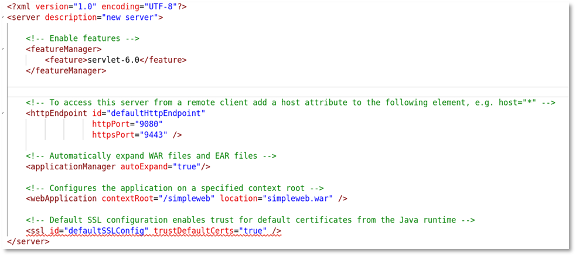

10. Save the configuration by using **CTRL+S**.

11. Close the **server.xml** file.

### 2.4	Using Liberty Dev Mode

Liberty development mode, or dev mode, allows you to develop applications with any text editor or IDE by providing hot reload and deployment, on demand testing, and debugger support. Liberty Dev Mode is enabled through Maven and Gradle projects.

Your code is automatically compiled and deployed to your running server, making it easy to iterate on your changes.

You can run tests on demand or even automatically so that you can get immediate feedback on your changes. You can also attach a debugger at any time to debug your running application.

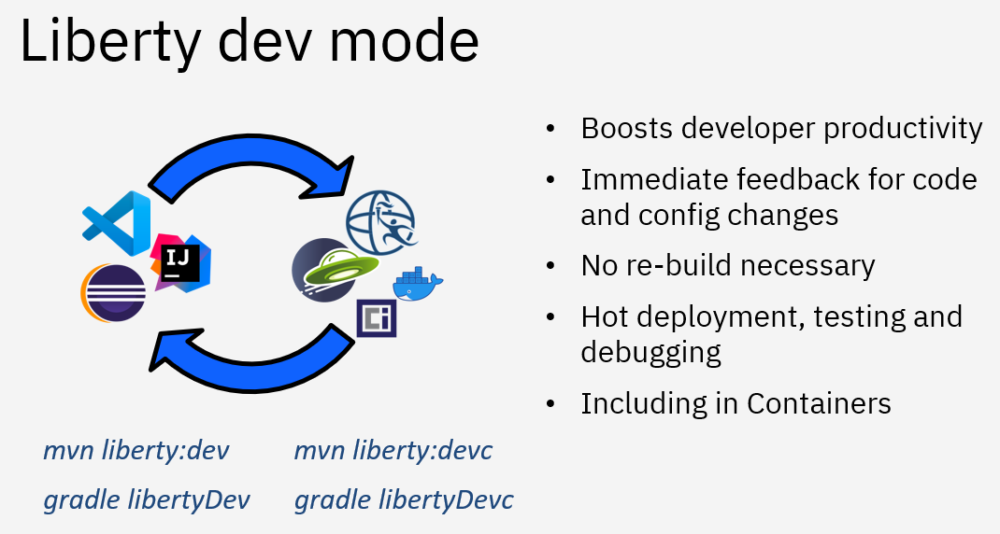

You can use the capabilities of Liberty dev mode inside and outside of an IDE. This provides you with the flexibility of choice. In a terminal window, you use Liberty in dev mode with maven by using the command **mvn liberty:dev** or **mvn liberty:devc** if you want to develop in a container. 

In the lab environment, the Liberty tools plugin is installed into Visual Studio Code. Therefore you use the integrated Liberty dashboard instead. 

1. In Visual Studio Code, expand the Liberty Dashboard.

    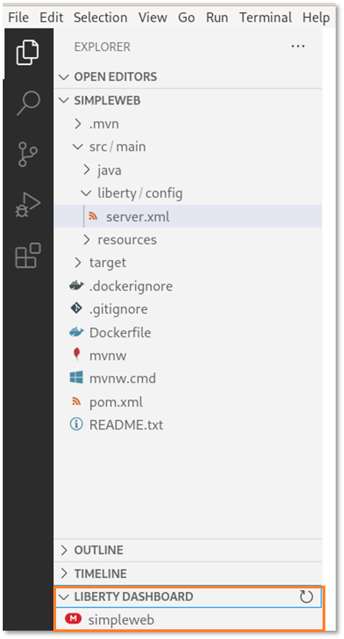

2. Right-click **simpleweb** and then **start** to start the server in dev mode.

    

3. A terminal opens within Visual Studio Code and you can see that the start of the build process gets triggered.

    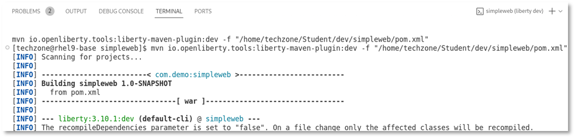

4. The Liberty plugin as well as the Liberty server artifacts get downloaded, then the server is ready for testing.

    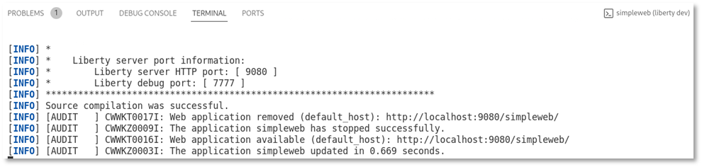

5. Switch to the browser window and enter the URL **localhost:9080**. You should see something like this:

    

    <table>
    <tbody>
    <tr class="odd">
    <td width=80></td>
    <td>
    
If you get a pop-up with <strong>Authentication required</strong>, enter the password <strong>IBMDem0s!</strong> and click <strong>Unlock</strong>.
    
</td>
    </tr>
    </tbody>
    </table>

    Now, let’s edit the **simpleweb** application.

### 2.5 Edit the simpleweb application

Now you edit the **simpleweb** application that only consists of a servlet. Thanks to Liberty code assistant, you don't have to write the code on your own. 

1. Switch to Visual Studio Code.

2. In Visual Studio Code, expand the path to **src/main/java/com/demo/rest**, then **right-click** on **demo** and select **New File**.

    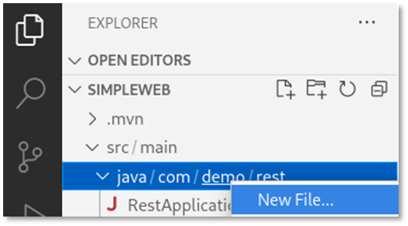

3. Enter the name **helloWorldServlet.java** and press **ENTER**.

    

4. The file **src/main/java/com/demo/helloWorldServlet.java** is generated and opens in an editor.

    

5. Remove all code from the file. Then enter **servlet**.

    
    
    The code assistant window is shown.

    <table>
    <tbody>
    <tr class="odd">
    <td width=80></td>
    <td>
    
If you do not see the code assistant window, enter <b>CTRL+Space</b> to activate it.
    
</td>
    </tr>
    </tbody>
    </table>

6. The code assistant offers some servlet methods for Jakarta EE. Select **servlet_doget**, and the required starter code gets generated. As you can see, the fields that should be changed are highlighted.

    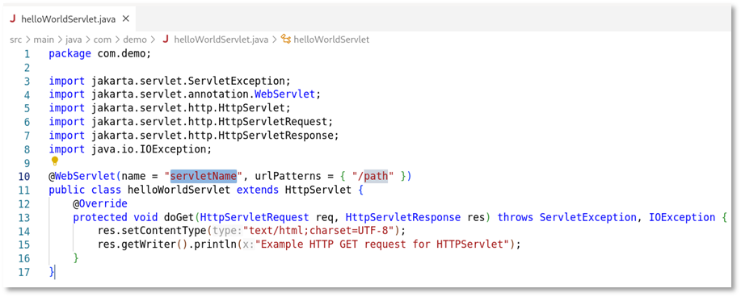

7. Change the **servletName** to **helloWorldServlet** and the **urlPatters** to **/helloWorld**. The code should now look like this:

    

8. Press **CTRL+S** to save the code change. Look at the terminal output. As Liberty is started in DevMode, the code changes are picked up automatically, the source gets compiled and Liberty gets updated.

    

9. Switch to the browser and open the URL **localhost:9080/simpleweb/helloWorld**. You should see the output of the created servlet.

    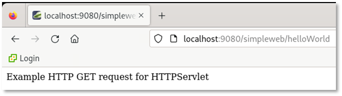

10. Switch back to Visual Studio Code and change the source code of the servlet response text to something like this: **helloWorld - Example HTTP GET request for HTTPServlet**

    

11. Save the changes and reload the page in the browser. The output should be updated.

    

12. Switch back to Visual Studio Code and close the editor for the file **helloWorldServlet.java**.

    Final step as a developer is to export the developed application as WAR file so that it can be used in the next part of the lab.

### 2.6 Export the developed application as WAR file

Export the developed application so that it can be deployed to Liberty by the operations team.

The generated maven pom by default does not generate a WAR file as it uses a “looseApplication” approach to optimize the inner-loop development experience. (For more details, see **https://github.com/OpenLiberty/ci.maven**). To change the default build behaviour, you need to adjust the pom.xml file and configure the Liberty maven plugin to generate a WAR by setting the property: **\<looseApplication>false\</looseApplication>**.

1. Switch back to Visual Studio Code.

2. In the Liberty dashboard, **right-click** on the **simpleweb** application and select **Stop** (or use the **CTRL+C** on the terminal window instead).

    

3. Verify in the terminal that Liberty is stopped.

    

4. In Visual Studio Code, open the file **pom.xml** and add to the Liberty plugin configuration the lines:
    
        <configuration>
        <looseApplication>false</looseApplication>
        </configuration>
    
    

5. If you would start Liberty now again in Dev Mode, the property looseApplication would be ignored and you would see a warning like this:   
 
    

    Therefore, you must start Liberty in run mode to generate the WAR file. This can be done by entering in the terminal window the command:
    
        mvn liberty:run

    

    As you can see in the screenshot above, maven has built the file **simpleweb.war** and stored it at the **~/Student/dev/simpleweb/target/** directory.

6. Scroll down and you can see that the app war file is installed into the directory **~/Student/dev/simpleweb/target/liberty/wlp/usr/servers/defaultServer/apps**.

    

7. Feel free to test the application in the browser, then stop the Liberty instance by using **CTRL+C**.

8. Close Visual Studio Code.

### 2.7 Create a server package

For the next lab, you need the WAR file as well as the **server.xml** that can be found in the created Liberty instance at: **~/Student/dev/simpleweb/target/liberty/wlp/usr/servers/defaultServer**.

More complex applications also depend on other files like utility jars, extra Liberty configuration files and JDBC drivers for example. 

So, instead of copying the files one by one, you could create a server package that contains all files.

What is a **server package**?
A server package can contain only the user directory or the full application server.  

The syntax of the server package command is: 

    server package server_name --archive=package_file_name.jar --include=all

With the option **--include=all**, the Liberty binaries as well as the usr directory get packaged.

For more details and options, see **https://www.ibm.com/docs/en/was-liberty/base?topic=line-packaging-liberty-server-from-command**.

1. To create the server package, execute the following command:

        ~/Student/dev/simpleweb/target/liberty/wlp/bin/server package defaultServer --archive=simpleweb-serverpackage.jar --include=all

    

2. To hand over the server package to the ops team, use the following commands: 

        cp ~/Student/dev/simpleweb/target/liberty/wlp/usr/servers/defaultServer/simpleweb-serverpackage.jar ~/Student/assets

### 2.8 Recap

Congratulations, you have finished the application development part.

**Let’s recap what you did so far.** 

You acted as a developer and used Visual Studio Code and the Liberty Tools for these tasks:

* generated a Liberty starter project including the required maven and Liberty configuration. 
* used the Liberty Tools configuration assistant to adjust the Liberty configuration.
* used Liberty Dev Mode for inner-loop development.
* updated the simpleweb application by using the Jakarta EE code assistant. 
* exported the web application as WAR file.
* created a server package including application and Liberty binaries.

Useful links: **https://github.com/OpenLiberty/liberty-tools-vscode/blob/HEAD/docs/user-guide.md** 

### 3. Liberty operations 

Now, you work with Liberty from an operational point of view. Development has handed over a Liberty server package to you. The server package contains all necessary configuration to run the application called **simpleweb**. The provided server package is typically not production-ready, as it is likely not portable between stages and does not fulfill the requirements regarding security and so on. 

In this part of the lab, you explore how to create configuration snippets and how to administer Liberty from the command line. But first you explore the server package and get an understanding about dynamic updates.

### 3.1 Explore the server package

You explore the Liberty server package to get a better understanding how to use it, in addition you use it to learn more about **Liberty administration from the command line** and **Liberty dynamic updates**.

<table>
<tbody>
<tr class="odd">
<td width=80></td>
<td>

In this section, you use the <strong>server run</strong> command instead of the <strong>server start</strong> command. This allows you to see the logs immediately instead of having to use a tail command. It also allows you to stop the Liberty server via <strong>CTRL+C</strong>

</td>
</tr>
</tbody>
</table>

### 3.1.1 Extract Liberty package from command line

1. Extract the Liberty server package and try to run it. When asked, enter **test** as target directory.

        cd ~/Student/ops/
        java -jar ~/Student/assets/simpleweb-serverpackage.jar

    

    The directory **test/wlp** got created and contains the configured Liberty instance including application. 
    
2. Run the following command to **get the Liberty version**:

        test/wlp/bin/productInfo version

    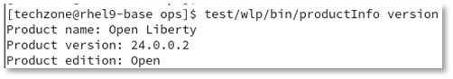

3. Run the following command to **list the Liberty features** that have been installed:

        test/wlp/bin/productInfo featureInfo

    

    As you can see, the server package provided by the developer only contains the **servlet-6.0** feature that is the only feature required by the application. 

4. Run the following command to get the **list of defined Liberty application servers**:

        test/wlp/bin/server list

    

5. **Start the Liberty server instance** by running the command:

        test/wlp/bin/server start defaultServer
    
    

    This runs the server in the background and the output is written to files in the **test/wlp/bin/servers/defaultServer/logs** directory.
    
    To start the server in the foreground (so the console messages are displayed in the command window) you would use the command 
    
        test/wlp/bin/server run defaultServer. 
        
    You use this command later in the lab.

6. View the Liberty server’s messages.log file to see the server startup messages via the command:

        cat test/wlp/usr/servers/defaultServer/logs/messages.log

    
    
    At the beginning of the log, you can see that Open Liberty version is used.
    The server is started when the message **“The defaultServer server is ready to run a smarter planet”** is displayed in the messages.log file.

7. Test that the application is accessible via URL **http://localhost:9080/simpleweb/helloWorld**

    

### 3.1.2 Liberty dynamic updates

Let’s do a short excurse about Liberty dynamic updates. You use Visual Studio Code to perform some minor configuration changes. For this part of the lab, you could instead also use a simple text editor like vi or gedit instead. 

1. Open Visual Studio Code.

        cd ~/Student/ops/test
        code .

    

2. Visual Studio Code opens. Click **Yes**, if you are asked to trust the author.

    

3. In Visual Studio Code, open a terminal window

    

4. In the terminal, use the tail command to display the Liberty message log.

        tail -f wlp/usr/servers/defaultServer/logs/messages.log

    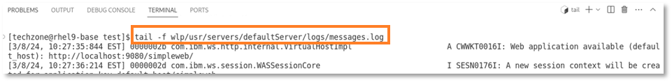

5. In Visual Studio Code, navigate to **wlp > usr > servers > defaultServer** and open the file **server.xml**.

    

6. In the **server.xml** file, change the httpPort setting from port **9080** to port **9081**.

    

    You can see in the terminal that the change is picked up and Liberty listens now on port **9081**.

    

7. Change the webApplication contextRoot setting from **“/simpleweb”** to **“/mysimpleweb”**.

    

    You can see in the log that the change is picked up.

    

8. Switch to the browser and access the application via URL **localhost:9081/mysimpleweb/helloWorld**.

    

    As you have seen, you can change the Liberty configuration without having to restart the server. 
    You explore this further later in the lab when you dynamically update the logging for example.
    Now let's stop the server.

9. In the terminal, press **CTRL+C** to stop the tail command. 

10. Stop the Liberty instance by executing in the terminal the command:

        wlp/bin/server stop defaultServer

    

### 3.2 Create Liberty configuration snippets

There are different ways to create a Liberty server configuration and there are often different roles involved to get the final configuration for production. The application specific configuration, for example, is typically created by the application developer while security related configuration is typically done by operations. Operations team is typically also responsible to make the configuration portable across stages, configure logging and so on. 

You could create Liberty configuration snippets by copying over the related snippets from the product documentation and adjust them in a normal text editor. In this part of the lab, you see that the Liberty tools plugin in Visual Studio Code can help you to speed up the create of configuration snippets as it provides configuration assistance including documentation. Let’s get started.

You now modify the file **server.xml** that is provided as part of the server package to make it more portable and re-usable.

1. In Visual Studio Code, open the file **server.xml** if you closed it previously.

    

2. Look at the httpEndpoint element.

    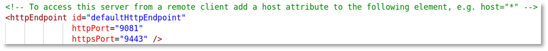

     As mentioned in the comment, the httpEndpoint is by default not accessible from a remote client.
     This is good from security point of view and works fine if the client is local to the server. But if you, for example, use a remote load balancer or a remote HTTP server, this does not work. So there are likely situations where you want to allow access to the application from a remote client and you must add a host attribute. You use the Liberty Tools configuration assistant to do this.

3. Place the cursor at the end of the line **<httpEndpoint id="defaultHttpEndpoint"** and press **ENTER** to add another line. 

    In the new line, press **CTRL+SPACE** to see the available attributes. 
    
    Use the arrow-down key and navigate to the **host** attribute to see the description of the attribute.

    

4. Select the host and your configuration should look like this:

    

    As you can see, the attribute host defaults to **localhost**.

### 3.2.1 Use variables for portability

To make the configuration portable, you replace the fixed values for ports and host with Liberty variables. Liberty variables can be defined with a default value and overridden from inside or outside Liberty. To show the concept, you adjust the httpEndpoint settings.

You could use the configuration snippet below to replace the existing httpEndpoint configuration with a portable configuration. 

    <httpEndpoint id="defaultHttpEndpoint"
                  host="${httpEndpoint_host}"
                  httpPort="${httpEndpoint_port}"
                  httpsPort="${httpEndpoint_secure_port}" />
    <variable name="httpEndpoint_host" defaultValue="*"/>
    <variable name="httpEndpoint_port" defaultValue="9080"/>
    <variable name="httpEndpoint_secure_port" defaultValue="9443"/>

Instead you use the Liberty configuration assistant to get an understanding how you could create such a configuration snippet.

1. Place the cursor in an empty line under the httpEndpoint section, then enter **var** and press **CTRL+SPACE**.

    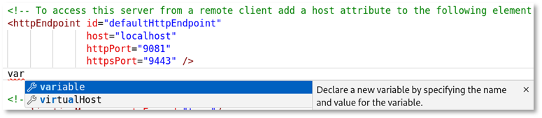

2. Select **variable**, then enter as name **"httpEndpoint_port"**.

    

3. Place the cursor after **name="httpEndpoint_port"**, enter a **SPACE** and press **CTRL+SPACE**.

    

4. Select **defaultValue** and enter as value **9080**.

     

5. Use copy and paste to create two additional variables: 
    - one with the name **"httpEndpoint_secure_port"** and the default value **"9443"**
    - the other one with the name **"httpEndpoint_host"** and the value **"*"**.
    
    Your configuration should now look like this:

    

6. Switch to the **httpEndpoint** section, remove for the attribute **host** the value **"localhost"**, enter **${ht** and press **CTRL+SPACE**.

    

    As you can see, the variable names are offered. 
    
7. Select **"httpEndpoint_host"**, then enter **"}"**. Your configuration should look like this:

    

8. Do the same kind of change for the attributes **httpPort** and **httpsPort**. 
    
    Your final httpEndpoint configuration should now look like this:

    

9. Save your changes.

    Your **server.xml** file should now look like this:

        <?xml version="1.0" encoding="UTF-8"?>
        <server description="new server">

        <!-- Enable features -->
        <featureManager>
            <feature>servlet-6.0</feature>
        </featureManager>
    

        <!-- To access this server from a remote client add a host attribute to the following element, e.g. host="*" -->
        <httpEndpoint id="defaultHttpEndpoint"
                      host="${httpEndpoint_host}"
                      httpPort="${httpEndpoint_port}"
                      httpsPort="${httpEndpoint_secure_port}" />
        <variable name="httpEndpoint_host" defaultValue="*"/>
        <variable name="httpEndpoint_port" defaultValue="9080"/>
        <variable name="httpEndpoint_secure_port" defaultValue="9443"/>

        <!-- Automatically expand WAR files and EAR files -->
        <applicationManager autoExpand="true"/>

        <!-- Configures the application on a specified context root -->
        <webApplication contextRoot="/mysimpleweb" location="simpleweb.war" />

        <!-- Default SSL configuration enables trust for default certificates from the Java runtime -->
        <ssl id="defaultSSLConfig" trustDefaultCerts="true" />
        </server>

    Now let's test if the Liberty configuration is really portable.

10. From the Visual Studio Code terminal, start the Liberty server instance via the following command:
        
        wlp/bin/server run defaultServer

    

    As you can see, the Liberty server gets started and listens on port **9080**.

11. Press **CTRL+C** to stop the server. 

12. Set the httpEnpoint_port value in the Operating System environment variable and start the Liberty server again.

        export httpEndpoint_port=9081
        wlp/bin/server run defaultServer

    

    As you can see, the Liberty server now listens on port **9081**, which shows that you can now override from outside Liberty the default settings defined in the Liberty server.xml file. In a Kubernetes environment, you could for example use a config map to change configuration settings.

13. Press **CTRL+C** to stop the server. Then unset the operating system variable by the following command:

        unset httpEndpoint_port
    This restores the httpEnpoint_port value in the Operating System environment variable to **9080**.

### 3.2.2 Use includes for better re-use and visibility

If you configure a Liberty server with resources like datasources or JMS queues, user registry and more, your configureation file can get quite long and not easy to be read and maintained. Liberty allows to specify configuration resources to get included into the server configuration. This helps to keep control over the configuration, provides better reuse of the different configuration and allows to split the responsibility for the configuration between different teams. The developer for example could create the application specific configuration and operations the security configuration.

You now use **includes** to structure the server configuration.

1. In the terminal in Visual Studio Code, copy the existing server.xml file into a new file called application-config.xml.

        cp wlp/usr/servers/defaultServer/server.xml wlp/usr/servers/defaultServer/application-config.xml

    

2. Open the newly created file **application-config.xml** in Visual Studio Code.

    

3. Remove all configuration inside the server section other than the definition of the **webApplication** element.
    Your **application-config.xml** should look like this:

    

4. Save the changes, then close the **application-config.xml** file.

5. Switch to the **server.xml** file. Delete the **webApplication** element, then enter **include** and press **CTRL+SPACE**.

    The Liberty configuration assistant shows you the available elements.

    

6. Select **include** and the element gets generated. As the value for **location**, enter **"application-config.xml"**.

    

7. As the owner of the server.xml file, you might want to decide what happens if the file to be included does not exist or contains conflicting configuration settings. 

    Go to the end of the include statement and press **CTRL+SPACE**. The available attributes for the include element are displayed.

    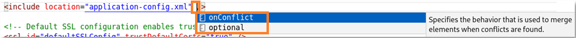

    As you can see, you could define the include file as optional, so Liberty would not throw an error if the include file is missing. 

8. Click **onConflict** to see the available attributes for that options. 

    

    If you want to make sure, that settings in the server.xml cannot be overridden by included files, select **IGNORE**, otherwise use **MERGE** or **REPLACE**. 
    
9. Click **MERGE** and your include statement should look like this:

        <include location="application-config.xml" onConflict="MERGE"/>

    

    You can configure multiple include files, for example one file for security-config.xml and another one for resource specific configuration settings like for databases or JMS. Now let's test if the **include** works.

10. Save the **server.xml** file.
11. From the Visual Studio Code terminal, start the Liberty server instance via the following command:

        wlp/bin/server run defaultServer

    As you can see, the **include** is found and processed, so that the application is started.

    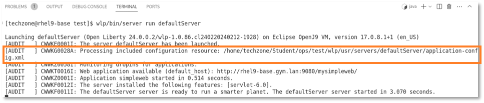

    Keep the server running as we need it in the next section.

### 3.2.3	Enable transport security

Right now, you are not able to access Liberty via HTTPS. While the HTTPS port 9443 is defined, SSL is not enabled in Liberty. SSL can be enabled using the transport security feature. So the next step is to enable transport security and look at other related topics like keystores.

1. In the file **server.xml**, navigate to the featureManager section.

2. Add the feature **transportSecurity-1.0** to the **featureManager** section by adding the line:

        <feature>transportSecurity-1.0</feature>

    Alternatively, you can use the configuration assistant to enable it.

    

3. Look at the logs and you can see that the feature is not available yet.

    

    This is due to the fact that the Liberty server package generated by the developer only includes the required features (features that have been defined in the server configuration file). You use the Liberty **featureUtility tool** to install the missing feature. The feature could be downloaded from a local repository if configured, in this case you download it from a central maven repository.

4. In the terminal window, stop the Liberty instance by pressing **CTRL+C**.

    Then execute the following command to install the missing feature from the maven repository:

        wlp/bin/featureUtility installFeature transportSecurity-1.0

    

5. Then start the Liberty instance again by running the following command:

        wlp/bin/server run defaultServer

    

    As you can see, Liberty created a certificate and placed it into the SSL key file **"wlp/usr/servers/defaultServer/resources/security/key.p12"**. 

6. Liberty used the variable **keystore_password** to secure the keystore. As you did not define a value for the variable keystore_password, Liberty generated a password and stored it in the **server.env** file. In Visual Studio, open the **server.env** file to see the keystore password. Your password likely looks different as it is generated randomly.

    

    Close the **server.env** file.

7. To make it more visible where the keystore password comes from, add the following definition to the **server.xml** file:

        <keyStore id="defaultKeyStore" password="${keystore_password}" />

    The keyStore element also allows you to specify a different keystore location and much more.

    

8. Review your configuration in **server.xml**. It should look like this:

        <?xml version="1.0" encoding="UTF-8"?>
        <server description="new server">

            <!-- Enable features -->
            <featureManager>
                <feature>servlet-6.0</feature>
                <feature>transportSecurity-1.0</feature>
            </featureManager>
    

            <!-- To access this server from a remote client add a host attribute to the following element, e.g. host="*" -->
            <httpEndpoint id="defaultHttpEndpoint"
                        host="${httpEndpoint_host}"
                        httpPort="${httpEndpoint_port}"
                        httpsPort="${httpEndpoint_secure_port}" />
            <variable name="httpEndpoint_host" defaultValue="*"/>
            <variable name="httpEndpoint_port" defaultValue="9080"/>
            <variable name="httpEndpoint_secure_port" defaultValue="9443"/>

            <!-- Automatically expand WAR files and EAR files -->
            <applicationManager autoExpand="true"/>

            <!-- Configures the application on a specified context root -->
            <include location="application-config.xml" onConflict="MERGE"/>

            <!-- Default SSL configuration enables trust for default certificates from the Java runtime -->
            <ssl id="defaultSSLConfig" trustDefaultCerts="true" />
            <keyStore id="defaultKeyStore" password="${keystore_password}" />
        </server>

9. Now let's see if the application is accessible via HTTPS. 

    Switch to the browser and access Liberty via **https://localhost:9443/mysimpleweb/helloWorld**.

    You should get a security warning like this:

    

10. Click **Advanced**, then scroll down and click **Accept the Risk and Continue**.

    

11. You should see the output of the web application.

    

12. Switch back to Visual Studio Code and stop the running Liberty instance by entering **CTRL+C** in the terminal window. 

13. Close Visual Studio Code.

### 3.2.4 Backup the generated files

You re-use the generated configuration snippets and other assets in the next section of the lab. Therefore it is a good approach to create a snippet repository. Configuration snippets are typically hosted in a git repository or so, here you use the folder **~/Student/assets**. You also use the asset directory to store the application WAR file.

1. Copy the generated configuration files as well as the application war file into the assets directory.

        cp ~/Student/ops/test/wlp/usr/servers/defaultServer/server.* ~/Student/assets

        cp ~/Student/ops/test/wlp/usr/servers/defaultServer/application-config.xml ~/Student/assets

        cp ~/Student/ops/test/wlp/usr/servers/defaultServer/apps/simpleweb.war ~/Student/assets

    

2. Verify that the assets directory contains the application WAR as well as the configuration files. It also contains the server package but this is no longer required.

        ls ~/Student/assets

    

### 3.2.5 Recap

In this section of the lab, you got an impression of how to create and use configuration snippets:

* used the **Liberty Tools configuration assistant** to create configuration snippets and to configure Liberty. 
* used the **Liberty featureUtility tool** to install missing features.
* learned how to use **variables** to make the configuration more portable.
* learned how to use **includes** to split the configuration into multiple re-usable files.
* created a security configuration. 

Comments:

* Instead of using the Liberty Tools configuration assistant in Visual Studio Code, you could also use the product documentation and copy & paste to create Liberty configuration snippets. 
* You could also use the IBM migration tools to transform an existing configuration for WebSphere Traditional and other runtimes into a Liberty configuration.

### 4. Liberty Administration

Now let’s switch to the Liberty Admistrator role and explore how to install and configure Liberty from an administrator point of view. 

A traditional administrator typically downloads the application server binaries from the IBM pages and uses a regular editor instead of an IDE like Visual Studio to configure Liberty. To download the latest version of WebSphere Liberty, the administrator can use the IBM support page: **https://www.ibm.com/support/pages/recommended-updates-websphere-application-server**.

### 4.1 Install Liberty from scratch

The best practice for Liberty installation is to create a minimal installation by using the Liberty kernel image and install only the required features on top of it. The latest WebSphere Liberty kernel image could be downloaded from the IBM support page. For simplicity, you use the International License Agreement for Non-Warranted Programs (ILAN) package that is available as zip file at: **https://public.dhe.ibm.com/ibmdl/export/pub/software/websphere/wasdev/downloads/wlp/24.0.0.1/wlp-kernel-24.0.0.1.zip**

1. Open a new terminal window.

2. Create a directory to store the Liberty package. 

        mkdir ~/Student/ops/software
    
    
    
3. Download and store the Liberty kernel image. 

        wget https://public.dhe.ibm.com/ibmdl/export/pub/software/websphere/wasdev/downloads/wlp/24.0.0.1/wlp-kernel-24.0.0.1.zip -P ~/Student/ops/software
    
    

4. Use the **ls** command to see that the kernel image is less than 17 MB in size. The overall disk footprint is larger depending on the required Liberty features.

        ls -lrt ~/Student/ops/software/
    
    

5. Create a directory for the integration environment. This is used for the Liberty installation.

        mkdir ~/Student/ops/int
        cd ~/Student/ops/int

    

6. Use the unzip command to extract the image.

        unzip ../software/wlp-kernel-24.0.0.1.zip

    

    <table>
    <tbody>
    <tr class="odd">
    <td width=80></td>
    <td>
    
On the IBM support page, you can find next to the convenience packages like the Liberty kernel package also Liberty archives for Liberty Core, Liberty Base or Liberty ND. To install such an archive, you would use a command like:
        <strong>"java -jar ../wlp-base-all-24.0.0.1.jar --acceptLicense ."</strong> 
    
</td>
    </tr>
    </tbody>
    </table>
    
7. Get the Liberty version by running the following command:

        wlp/bin/productInfo version

    

    As you can see, this is an ILAN package that can be used for evaluation as well as for production. 

8. Get the list of Liberty features that are part of the installation:

        wlp/bin/productInfo featureInfo

    

    As you can see, no feature is included in the kernel image.

    Now that Liberty is installed, the next step is to create a Liberty server instance.

    <table>
    <tbody>
    <tr class="odd">
    <td width=80></td>
    <td>
    
As you have seen, the installation of Liberty is basically an unzip.  If you  want to update Liberty later on, you can either apply a jar file or simply replace the binaries.
</td>
    </tr>
    </tbody>
    </table>

### 4.2	Introducing Liberty Environment Variable Configuration

You can customize the Liberty environment using certain specific variables to support the placement of product binaries and shared resources. The Liberty environment variables are specified using server.env file. You can use server.env file at the installation and server levels to specify environment variables such as **JAVA_HOME**, **WLP\_USER\_DIR** and **WLP\_OUTPUT\_DIR**.

Here some of the Liberty specific variables can be used to customize the Liberty environment: (see also **https://www.ibm.com/docs/en/was-liberty/nd?topic=liberty-customizing-environment**) 

* **${wlp.install.dir}** - This configuration variable has an inferred location. The installation directory is always set to the parent of the directory containing the launch script or the parent of the /lib directory containing the target jar files.
* **JVM\_ARGS** - This environment variable can be used to specify a list of command-line options, such as system properties or -X parameters, that are passed to the JVM when the server starts. Any values that contain spaces must be enclosed in quotes.
* **WLP\_USER\_DIR** - This environment variable can be used to specify an alternative location for **wlp.user.dir**. This variable must be an absolute path. If this variable is specified, the runtime environment looks for shared resources and server definitions in the specified directory. **WLP\_USER\_DIR** can be specified only in the **${wlp.install.dir}/etc/server.env** file because the purpose of this variable is to specify where the remaining configuration is located. After the remaining configuration is found and merged, no further configuration in a different location is expected, or supported
*  **WLP\_OUTPUT\_DIR** - This environment variable can be used to specify an alternative location for server generated output such as logs, the workarea directory, and generated files. Files in the logs directory can include console.log, messages.log, and any generated FFDC files. Generated files can include server dumps that are created with the server dump or server javadump command. This variable must be an absolute path.

### 4.3 Create a Liberty server instance

The **Liberty server** command supports actions for starting, stopping, creating, packaging, and dumping a Liberty server. The **server create** command creates a new Liberty server with the name specified. Additional detail on the server command can be found here: **https://www.ibm.com/docs/en/was-liberty/base?topic=line-server-command-options**

The **server create** command creates by default the user directory in a sub-directory of the **\${wlp.install.dir}** directory. In production, it is recommended to store the Liberty configuration in a separate directory. This can be done by setting the **WLP\_USER\_DIR** environment variable.

1. The **etc** directory as well as the **server.env** file are not created as part of the installation.  
    Use the following commands to set the variable **WLP\_USER\_DIR** to **/home/techzone/Student/ops/int/wlp_usr** in the **server.env** on runtime level.  
    (Keep in mind that the path in **server.env** must be absolute, **~/Student**, for example is not supported):

        mkdir ~/Student/ops/int/wlp/etc
        echo "WLP_USER_DIR=/home/techzone/Student/ops/int/wlp_usr" > ~/Student/ops/int/wlp/etc/server.env
        cat ~/Student/ops/int/wlp/etc/server.env

    

2. Run the following commands to create a new server named **"myServer"**:

        wlp/bin/server create myServer

    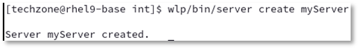

    The new server is created in the following directory: **wlp_usr/servers/myServer**.

3. Run the following command to verify the name and the path of the server instance:

        wlp/bin/server list

    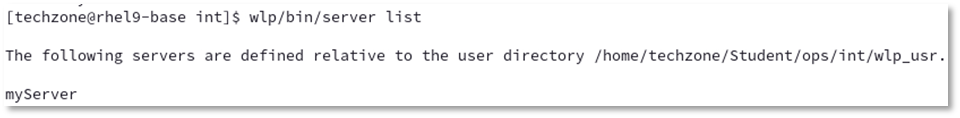

4. Run the following command to list the files and directories that have been created for myServer:

        ls -lrt wlp_usr/servers/myServer

    

5. Replace the generated Liberty configuration with the configuration that you stored in the assets directory.

        cp ~/Student/assets/server.* wlp_usr/servers/myServer
        ls -lrt wlp_usr/servers/myServer

    

    <table>
    <tbody>
    <tr class="odd">
    <td width=80></td>
    <td>
    
In the Liberty setup, you now have a <strong>server.env</strong> file on two levels:  
        - on <strong>runtime level</strong> at <strong>${wlp.install.dir}/etc/server.env</strong> and  
        - on <strong>server level</strong> at <strong>${server.config.dir}/server.env</strong>.  
        If both files are present, the contents of the two files are merged; values in the server-level file take precedence over values in the runtime-level file.
    
</td>
    </tr>
    </tbody>
    </table>

6. Verify that the pre-defined HTTP settings fit to your environment:

        cat wlp_usr/servers/myServer/server.xml | grep http

    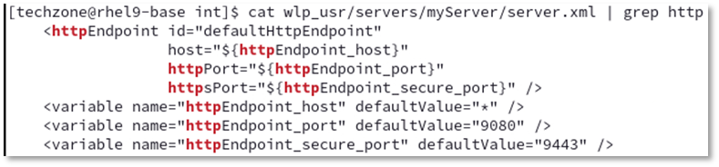

    <table>
    <tbody>
    <tr class="odd">
    <td width=80></td>
    <td>
    
If you want to change those port values, you could define them in the <strong>server.env</strong> file or <strong>bootstrap.properties</strong> file for example.   Alternatively you could define the related variable on the operating system level. 
    
</td>
    </tr>
    </tbody>
    </table>

### 4.4	Install required features

You installed the Liberty kernel package that does not contain any features. The next step is to install the required features. Instead of looking into the Liberty configuration to determine which features are required, you can let Liberty inspect which features are missing. This can be done using the featureUtility and specifying the server you are looking for. The command by default downloads the required features from the online repository. In an air-gapped environment, you could download the feature repository from the IBM support page and then specify in the featureUtility command to use a local repository. 

1. To download and install the required features, use the following command:

        wlp/bin/featureUtility installServerFeatures myServer

    

    As you can see, the command detected that the features for **servlet-6.0** and **transportSecurity-1.0** were missing. It also downloads the feature **ssl-1.0** as **transportSecurity-1.0** depends on it.

2. Verify that the Liberty features have been installed by using the following command:

        wlp/bin/productInfo featureInfo

    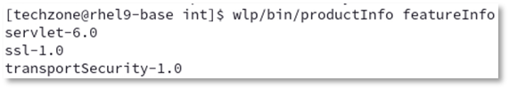

### 4.5	Use your own keystore

If you do not create a keystore but enable SSL, Liberty creates a keystore with a random password. Now, you create your own keystore with a password of choice. 

1. Run the following command to create a keystore

        wlp/bin/securityUtility createSSLCertificate --server=myServer --password=mySecret

    

    As you can see, the command uses the hostname and server name as subjectDN and encodes the password using xor. The command also allows to use aes encoding or encryption, see https://www.ibm.com/docs/en/was-liberty/base?topic=applications-securityutility-command.

2. Our server template has already configured SSL and uses a variable to specify the keystore password. Use the following commands to review what is configured in the server.xml file:

        cat wlp_usr/servers/myServer/server.xml | grep trans
        cat wlp_usr/servers/myServer/server.xml | grep keystore

    

3. The keystore password is configured in the server.env file. Use the following command for review the settings:

        cat wlp_usr/servers/myServer/server.env;echo

    

    As expected, the password used for the keystore does not match to the one in **server.env** and must be updated. 
    
4. Best practice is to store the password encoded or encrypted. In this case, you use encoding via aes and store the password in the server.env file. To generate the encoded password, you can use the securityUtility encode command. Use the following command to update the server.env file with the encoded keystore password of “mySecret”, then review the result:

        echo "keystore_password=$(wlp/bin/securityUtility encode --encoding=aes mySecret)" > wlp_usr/servers/myServer/server.env
        cat wlp_usr/servers/myServer/server.env

    

    <table>
    <tbody>
    <tr class="odd">
    <td width=80></td>
    <td>
    
The encoded keystore password is not unique, so you might have a different password as in the screenshot above.   
        But as long as you use the same password to be encoded, all of the different resulting strings are valid. 
    
</td>
    </tr>
    </tbody>
    </table>

### 4.6	Verify that the server configuration works:

1. Start the server via the following command:

        wlp/bin/server start myServer
        tail -f wlp_usr/servers/myServer/logs/messages.log

    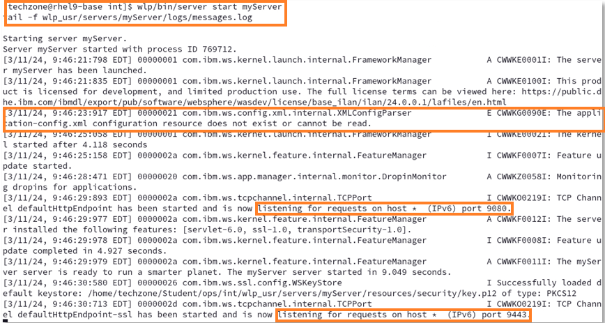

    As you can see, the Liberty server is running and listens on port **9080** and **9443**. You can also see that it complains about the **missing include file application-config.xml**. You fix this later.

2. Verify that the server is accessible via HTTPs. Switch to the browser and access the web application via the URL **https://localhost:9443**. 
    
    As before, you get a warning that your connection is not secure. Click **Advanced**, scroll down and click **"Accept the Risk and Continue"**. Then you should be able to access the application.

    

3. Switch back to the terminal window and press **CTRL+C** in the terminal window to stop the tail command.

4. Stop the server via the following command:

        wlp/bin/server stop myServer

### 4.7	Deploying a sample application to Liberty

In the first part of this lab, you used the Liberty Tools to develop an application and configure Liberty. The application got deployed via maven under the cover. Then you used the Liberty server package that already included the deployed application. In this section of the lab, you deploy an application to Liberty using two different techniques.

First, you simply copy the application WAR module into the Liberty **"dropins"** directory. The dropins directory is monitored by Liberty. As deployable units (WAR, EAR, JAR) are added to the directory, Liberty automatically deploys and starts the application on the Liberty server. 
The **dropins** directory can be used for applications that do not require extra configuration like security role mapping. As the deployable units are removed from the dropins folder, the applications are stopped and removed from the running Liberty server.

1. In the terminal window start the server and use the tail -f command to view the messages.log file.

        wlp/bin/server start myServer
        tail -f wlp_usr/servers/myServer/logs/messages.log

2. **Right-click** on **terminal** and select **New Window** to open a second terminal window.

    

3. In the new terminal window, navigate to the int directory:

        cd ~/Student/ops/int/

4. Copy the web application into the dropins directory.

        cp ~/Student/assets/simpleweb.war wlp_usr/servers/myServer/dropins

    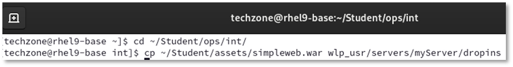

5. Switch to the terminal window where the tail command is running. You can see messages that the application deployment has taken place, the application simpleweb application is started and is available at **http://rhel9.techxchange.local:9080/simpleweb/**.
    
    Be aware that Liberty defined the context root based on the name of the WAR file as **"/simpleweb"**.

    

6. Verify that the application is accessible by opening a browser at: **http://localhost:9080/simpleweb/helloWorld**

    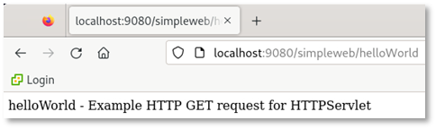

7. In the terminal window where tail is running, you can see that the application is accessed.

    

8. Switch back to the terminal where you entered the copy command and remove the deployed application from the dropins directory using the following command:

        rm wlp_usr/servers/myServer/dropins/simpleweb.war

9. Switch back to the terminal window where tail is running. You can see that the application is removed.

    

    While the dropins directory can be used for applications that do not require extra configuration, deploying the application by adding it to the Liberty server configuration provides the freedom to configure the Liberty server based on the application configuration requirements. 

    Now you deploy the simpleweb application by adding it to the Liberty server configuration.

    The default place for applications is: **${server.config.dir}/apps**.

10. Switch back to the terminal window not running tail. Copy the application WAR file into the apps directory by using the following command:

        cp ~/Student/assets/simpleweb.war wlp_usr/servers/myServer/apps
        ls -lrt wlp_usr/servers/myServer/apps/*.war

    

11. To define the application in the Liberty configuration file, look at the application configuration that is provided as a snippet.

        cat ~/Student/assets/application-config.xml

    

    As you can see, a different context root is defined.

12. You add the webApplication element to the Liberty configuration by using the **include** concept. Review that the include element and the properties that have already been defined in the **server.xml** file.

        cat wlp_usr/servers/myServer/server.xml | grep include

    

13. Copy the **application-config.xml** into the server directory.

        cp ~/Student/assets/application-config.xml wlp_usr/servers/myServer
        ls -lrt wlp_usr/servers/myServer

    

14. Switch back to the terminal window running tail. You can see that the application **simpleweb** gets deployed, this time with the context root **mysimpleweb**. 

    

15. Finally test the application in the browser via URL **http://localhost:9080/mysimpleweb/helloWorld**. 

    

**You have successfully deployed the web application into Liberty, first via the dropins directory, then by adding it to the server.xml file via include.**

### 4.8	Change logging and tracing by using ConfigDropins

Right now, you used the **include** concept to enhance the **server.xml** file with additional configuration files. Alternatively, you can specify additional configuration files in the **configDropins** directory without specifying include elements in the **server.xml** file. If you want to add configuration files to override anything in the **erver.xml** file of the server, create a **configDropins/overrides** directory. 

In this case, you want to add/change the log level of the application server.

1. From the second terminal window, issue the following command to create a **configDropins** directory in the server directory.

        mkdir -p wlp_usr/servers/myServer/configDropins/overrides

    

    **Add INFO logging output to the console**

    Liberty provides the ability to set the logging level to any of the supported log levels defined in the documentation: https://www.ibm.com/docs/en/was-liberty/base?topic=liberty-logging-trace 

    - AUDIT logging enables logging of “Significant event affecting server state or resources”
    - INFO logging enables of “General information outlining overall task progress”
    
    By default, the Liberty Server has the console log level set to AUDIT.
    
    In this section, you change the level of log messages written to the console from AUDIT to INFO, which results in additional logging messages.
    You perform this activity not directly in the server.xml file but using the configDropins concept. Purpose is that you could change the log level easily on the fly and switch back to the previous level without having to manually edit a file. 

    <table>
    <tbody>
    <tr class="odd">
    <td width=80></td>
    <td>
    
Note:  
        It is also possible to set default logging options in the bootstrap.properties file.  
        If the logging options are set in the bootstrap.properties file, the logging options take effect very early in server startup,  
        so it may be useful for debugging server initialization problems.
    
</td>
    </tr>
    </tbody>
    </table>

2. Switch to the terminal currently running the tail on the file **messages.log** and press **CTRL+C** to stop it.
    
3. Review the current console logging and you can see that it only contains messages from type AUDIT.

        tail -f wlp_usr/servers/myServer/logs/console.log

    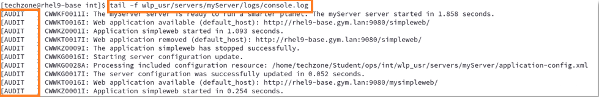

4. Switch to the second terminal window. Create a server configuration file to change the console log level to INFO via the following command:

        echo '
        <server>
            <logging consoleLogLevel="INFO"> </logging>
        </server>
        ' > wlp_usr/servers/myServer/configDropins/overrides/loglevel-config.xml

    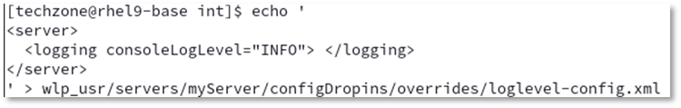

5. Switch to the terminal window running tail to verify, that the new file is detected.

    

    You verify that messages of log level **INFO** now are logged during the configuration of tracing.

    **Update trace specification**

    By default, the Liberty Server trace specification is set to **"\*=info=enabled"**. 

    To update the trace specification, you again use the configDropings concept.

6. Switch to the second terminal window. Update the file **configDropins/overrides/loglevel-config.xml** to include a trace specification via the following command:

        echo '
        <server>
            <logging consoleLogLevel="INFO" traceSpecification="webcontainer=all=enabled">
            </logging>
        </server>
        ' > wlp_usr/servers/myServer/configDropins/overrides/loglevel-config.xml

    

7. Switch to the terminal window running tail to verify, that the new file is detected.

    

    As you can see, messages of log level **INFO** are displayed now, which means that the change of the consoleLogLevel is picked up.  
    The message indicates as expected, that the trace level is set to “webcontainer=all”. 
    
8. Switch to the second terminal window to verify that the trace is created.

        ls -lrt wlp_usr/servers/myServer/logs

    

9. Remove the file to set the trace level back to default. 

        rm wlp_usr/servers/myServer/configDropins/overrides/loglevel-config.xml

10. Switch to the terminal window running tail to verify, that the new file is detected.

    

    As you can see, the trace specification is changed back to **"\*=info"**.

11. Press **CTRL+C** in the terminal window to stop the tail command.

12. Stop the Liberty instance using the following command: 

        wlp/bin/server stop myServer

13. Delete the generated trace files by using  the following command:

        rm wlp_usr/servers/myServer/logs/trace*.log

    As you have seen, the logging component can be controlled through the server configuration and it is quite convenient to enable and disable tracing using configDropins.

    **Configure logging in the bootstrap.properties file**

    Occasionally, you might need to configure trace to diagnose a problem that occurs before the **server.xml** file is processed. Or you want to change the log format to something other than basic. In this case, the equivalent configuration properties can be specified in the **bootstrap.properties** file. 

    If a configuration property is specified in both the **bootstrap.properties** file and the **server.xml** file, the value in **bootstrap.properties** is used until the **server.xml** file is processed. Then, the value in the **server.xml** file is used. Avoid specifying different values for the same configuration property in both the **bootstrap.properties** and the **server.xml** file.

    You now change the log format to json. As the bootstrap.properties file does not exist, you simpoly create it.

14. Create a **bootstrap.properties** file that defines the property **com.ibm.ws.logging.console.format** by executing the following command: 

        echo 'com.ibm.ws.logging.console.format=json' > wlp_usr/servers/myServer/bootstrap.properties
        cat wlp_usr/servers/myServer/bootstrap.properties

    

15. Start the server via **server run** and you can see that the log format is set to JSON.

        wlp/bin/server run myServer

    

16. In the terminal window, press **CTRL+C** to stop the server.

17. Change the log format back to default by deleting bootstrap.properties, then run the server again.

        rm wlp_usr/servers/myServer/bootstrap.properties
        wlp/bin/server run myServer

    

18. In the terminal, press **CTRL+C** to stop the server.

    If you are interested into additional logging attributes, please look at: https://www.ibm.com/docs/en/was-liberty/base?topic=liberty-logging-trace
 

### 4.9	Review the Liberty configuration via Liberty REST APIs

If you use several includes or config dropins, you might run into the situation where you want to review the final setup. This can be done by using the **restConnector** APIs. 

**Configure the admin access to the Liberty instance**. 

1. First of all, you need a strong password as the APIs provide access to sensitive data, which could help a hacker to manipulate the system. Use the **securityUtility** to create a secure password as **LibertyIsGreat**.

        wlp/bin/securityUtility encode --encoding=aes LibertyIsGreat

    

    As before, the encoded password is not unique, so your output likely looks different that the one above. But both are valid.

2. Use the following commands to setup and configure the restConnector.
    
    a. Update the user password in the following code snippet or keep the password as is.

        echo '
        <server>
            <featureManager>
                <feature>restConnector-2.0</feature>
            </featureManager>
        <quickStartSecurity userName="admin" userPassword="{aes}ALCpb79MrIuO8aVUdyXKVDWNssXfX3OmL+xD2J3jWcOgLwrIq1f7/qO8tCR7JwNmcQ==" />
        </server>
        ' > wlp_usr/servers/myServer/configDropins/overrides/rest-config.xml

    

    b. As the restConnector feature is not installed so far, switch to a terminal window to install the missing features via command:

        wlp/bin/featureUtility installServerFeatures myServer

    

4. Start the Liberty instance by using the command:

        wlp/bin/server start myServer

5. From a browser window, access the Liberty REST APIs via the URL **https://localhost:9443/ibm/api/config**.  
    Enter Username/Password as: **admin**/**LibertyIsGreat**.

    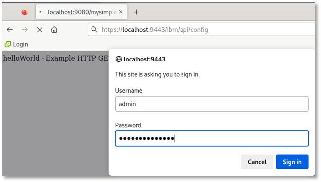

6. If asked, don’t save the password in the browser. Your browser should display something like this:

    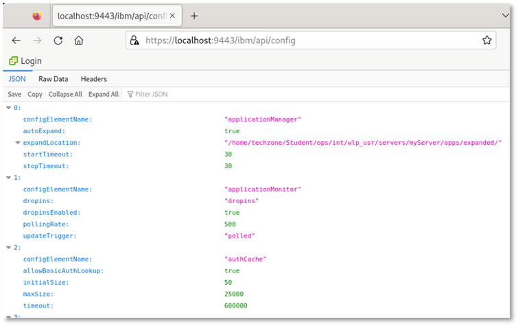

7. In the browser window, press **CTRL+F** and enter **webapp** to search for webapp. You should find the related settings.

    

8. Search for **logging** and you get all attributes currently used for logging.

    

9. Finally stop the server and remove the restConnector configuration.

        wlp/bin/server stop myServer
        rm wlp_usr/servers/myServer/configDropins/overrides/rest-config.xml

    For more details about the restConnector for administration, please look at: **https://www.ibm.com/docs/en/was-liberty/base?topic=features-admin-rest-connector-20**

### 4.10 Using the Liberty AdminCenter

The Liberty **AdminCenter** can be used to monitor the status of the Liberty server. You define two users, an administrative user with the role **admin** and the second user with the role **reader**. Use again the securityUtility to create two secure passwords.

1. Create a password as **Liberty4Admins** for the admin user.

            wlp/bin/securityUtility encode --encoding=xor Liberty4Admins

    

2. Create a password as **Liberty4Readers** for the second user.

            wlp/bin/securityUtility encode --encoding=xor Liberty4Readers

    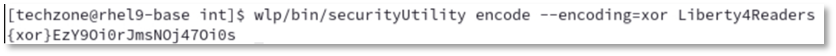

3. Execute the following command to Configure the AdminCenter with the two users using the generated passwords generated before.

        echo '
        <server>
            <featureManager>
                <feature>adminCenter-1.0</feature>
                <feature>websocket-2.1</feature>
            </featureManager>
            <!-- Configure administrative roles. -->
            <basicRegistry realm="basicRealm">
                <user name="admin" password="{xor}EzY9Oi0rJmseOzI2MSw=" />
                <user name="reader" password="{xor}EzY9Oi0rJmsNOj47Oi0s" />
            </basicRegistry> 
            <!-- Assign 'admin' to Administrator -->
            <administrator-role>
                <user>admin</user>
            </administrator-role>
            <reader-role>
                <user>reader</user>
            </reader-role>
        </server>
        ' > wlp_usr/servers/myServer/configDropins/overrides/adminCenter-config.xml

    

4. As the AdminCenter feature is not installed so far, switch to a terminal window to install the feature via command:

        wlp/bin/featureUtility installServerFeatures myServer
    
    

5. Start the server and look at the log:

        wlp/bin/server start myServer
        tail -f wlp_usr/servers/myServer/logs/messages.log

    

    As you can see, the AdminCenter feature **adminCenter-1.0** is enabled. 
    
6. Access the Liberty Admin Center via URL **https://localhost:9443/adminCenter**, then enter the credentials for the admin user (**admin**/**Liberty4Admins**) and press **Submit**.

    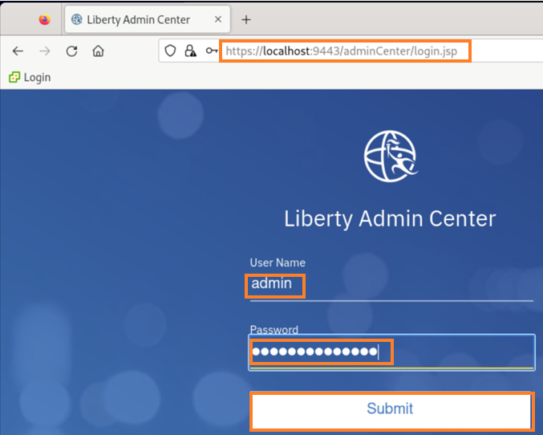
    The Admin Center Toolbox is displayed.

7. Click **Explore** to explore the Liberty status, the applications as well monitoring data and configuration.

    

8. On the tab **Overview** look at the running servers and applications. 

    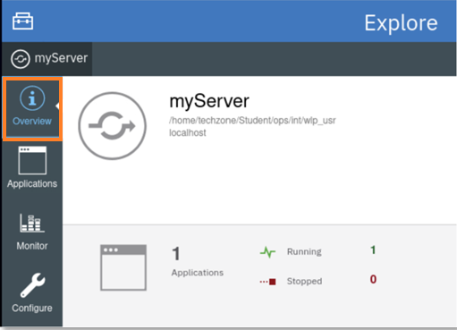

    You would see more than one server if a collection would have been defined.

9. On the tab **Applications** you can see the running applications. As a user with admin rights, you can use the menu to start, stop or restart an application.

    

10. On the tab **Montor**, you can see basic performance data. 

    

    As you can see here, the Used Heap Memory max value above 1.9 MB, which indicates that max heap has not been defined. You change that in the next section of the lab.

11. On the tab **Configure**, you can see the current configuration. 

    

    You can see a warning that remote file access is not configured. You can ignore that as you do not configure Liberty via AdminCenter.  
    But you could click the link to see the configuration in design and source view.

12. Select to log out as admin.

    

13. Log in as user **reader** with password **Liberty4Readers**.

    

14. Click **Explore**, then select the tab **Applications**. Try to click the twisty next to the **simpleweb** application and you can see that you are not auithorized to start or stop an application.

    

15. Select to log out as reader.

    

16. In the terminal window, press **CRTL+C** to stop the tail command. 

17. Stop the Liberty server.

        wlp/bin/server stop myServer

### 4.12 Recap

Let’s recap what you did in this part of the lab: 

- installed a Liberty server using the Liberty kernel image.
- used Liberty environment variables to separate the Liberty configuration from the binaries.
- created a Liberty server instance and installed missing features.
- deployed a simple web application via dropins and via server.xml.
- configured logging via server.xml and server.env.
- changed the Liberty heap size via jvm.options.
- used the REST API to see the Liberty configuration.
- used Liberty Admin Center to see monitoring data and administer Liberty apps.
 

### 5 Lab Cleanup

1. Once you are done, make sure that Liberty and Visual Studio Code is not running.

2. Delete the Student folder via the command:

        rm -rf ~/Student

3. Close the browser and all terminal windows

## Summary

In this lab, you learned how to develop a simple application as a developer, how to deployment and configure the application as an configuration opertor, and how to install and configure Liberty as an administrator.

**Congratulations!**

You have successfully completed the lab **Liberty Getting Started**
